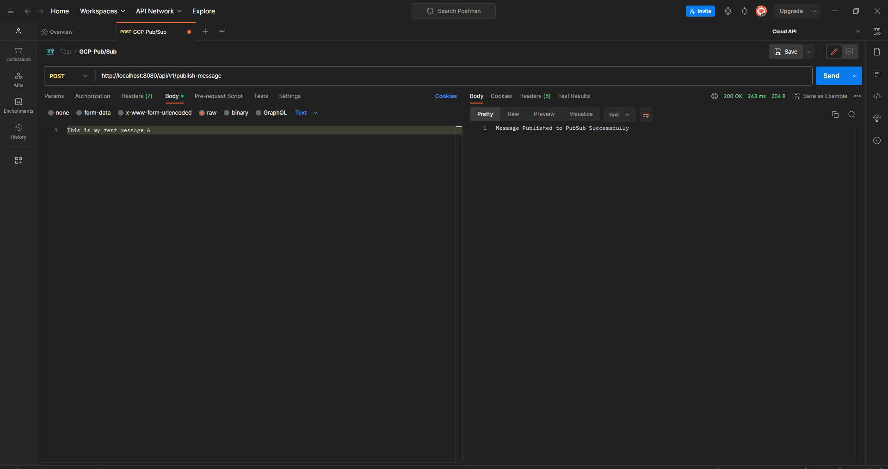

# Kisi Coding Challange
By **Sharon Sawe : sharonsawe02@gmail.com** 

* This application contains the Adapter and Atomic for the Google Publisher/Subscriber Messaging service
* The adapter is found in the `MessageProducer.class` while the atomic can be found in the `MessageConsumer.class`
* Clone this repo to your computer and run it using **Intellij** or **Spring Tool Suite**. The app will run on port 8080
* To test the application, open `Postman` and send a **POST** request to the `http://localhost:8080/api/v1/publish-message` URL,  setting the body to **Text** and passing the message you want to send to GCP Pub/Sub as shown below:

* Check logs to see the message being consumed from GCP Pub/Sub Topics
